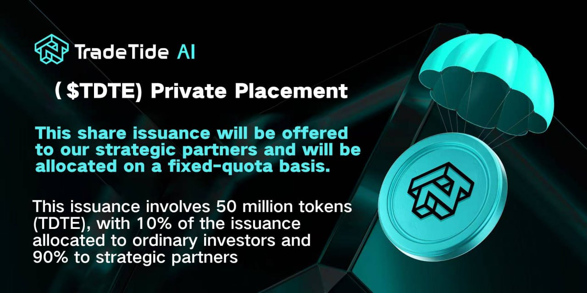

Release Date: 2025-12-19

Warmest congratulations on the \$TDTE subscription exceeding \$150 million in 24 hours! Based on the current subscription progress, the pre-sale funds for \$TDTE are expected to exceed \$1 billion.

Given that the subscription funds from strategic partners and the global community have significantly exceeded the original pre-sale amount during the current pre-sale phase of TradeTideAI (\$TDTE), in order to better coordinate the subscription progress and ensure the orderly advancement of the overall ecosystem plan, the project team, after comprehensive evaluation, hereby officially announces the $TDTE private placement arrangement.

## I. Background Explanation of Private Placement

During the pre-sale process, the TradeTideAI project received significant attention and support from various parties. As the subscription scale continued to grow, in order to ensure a reasonable allocation among different participation levels and to balance institutional collaboration with the development of the community ecosystem, the project team decided to launch this targeted share issuance mechanism.

## II. Total Amount of Private Placement

The total amount of $TDTE issued in this private placement is: 50,000,000 TDTE. This issuance will be allocated according to different participation categories.

## III. Institutional Targeted Allocation Arrangements

- Allocation quantity: 45,000,000 TDTE

- This accounts for 90% of the total amount raised in this private placement.

- Allocation method: Fixed allocation mechanism

This section is primarily used for collaboration arrangements between strategic partners and institutional levels to support the project's continued progress in technology development, ecosystem expansion, and long-term planning.

## IV. Open to General Participants

- Available quantity: 5,000,000 TDTE

- This accounts for 10% of the total amount raised in this private placement.

- Allocation method: Random allocation mechanism

This arrangement is intended to be open to general participants worldwide, further enhancing community engagement and ecological diversity.

## V. Timeline Explanation

**The registration deadline for this private placement is 17:00 on December 22nd (based on the official system time).**

**Registration information submitted after the aforementioned deadline will not be included in the statistics for this private placement.**

## VI. Important Announcement

- This press release is for project information disclosure and rule explanation only.

- This private placement does not constitute any form of return guarantee or investment advice.

- All allocation results are subject to the final official announcement by the project party.

- The project party reserves the right to make reasonable adjustments to relevant details, provided they comply with regulations.

## VII. Project Outlook

TradeTideAI will continue to steadily advance its AI technology capabilities, strategy system development, and long-term ecosystem development. Further progress will be continuously released to the public through the official website and official channels.

